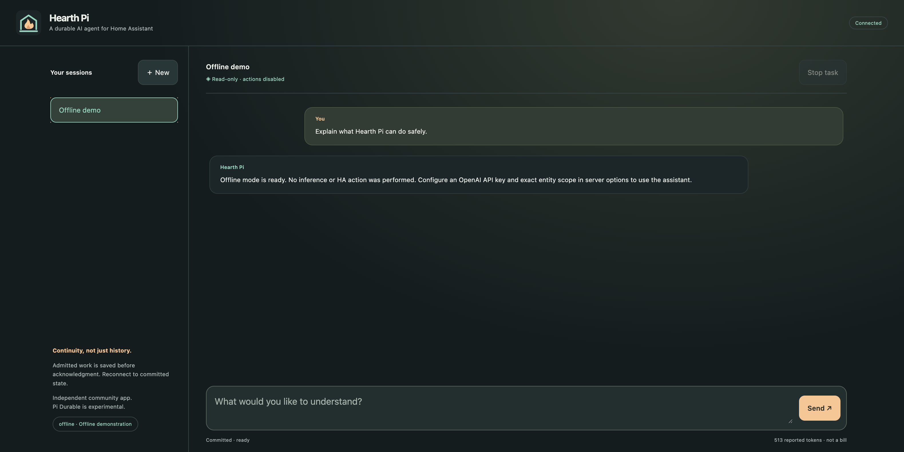

# Hearth Pi

### A durable AI agent for Home Assistant


**Independent community App · 0.1.0 · experimental.** Hearth Pi is not an official Home Assistant or Pi product. Pi Durable 1.0.0 explicitly warns that its API can change without notice. This repository is an initial locally verified implementation, not a claim of live deployment, an audit, or a published App-store release.

A thoughtful chat surface for understanding your home—with a reliable boundary between **a suggestion** and **an action**.



_Real browser capture using synthetic offline data. No model inference or Home Assistant action was performed._

- **Continuity, not just saved chats.** Real version-pinned `@earendil-works/pi-durable` commits admitted inputs, task checkpoints, transcripts and application documents to SQLite with `synchronous=FULL`. Interrupted model/read work resumes after reopening. One SQLite connection owns the store exclusively.
- **Your sessions, your view.** Persistent ownership-checked sessions, reconnecting full SSE snapshots, committed partial answers, tool visibility, reported token usage and mobile-friendly text rendering.
- **Read-only by default.** Four original HA extension tools: scoped state search, individual state detail, live allowlisted-service discovery and immutable service proposals. Empty entity scope denies all reads. No shell, filesystem, admin, configuration-write or generic network tools.
- **Human decisions, durable receipts.** Optional exact allowlisted light/switch actions require review of the original entity/data/hash. A dispatch intent is committed before one external attempt. Timeout or interrupted dispatch stays **unknown**, never automatically retried. HTTP acceptance is not device-state verification.

For ordinary voice control, consider [official Assist](https://www.home-assistant.io/voice_control/) first. Hearth Pi explores durable agent execution and exact reviewed actions, not replacing Assist or granting an agent administrative access. A plain chat-history file—or regular Pi coding agent—does not provide these task/admission checkpoints or our external-action ledger. We do **not** promise exactly-once physical effects.

## Try it without AI credentials

Target: **Node 24.21.0 LTS**, npm, a clean checkout. No HA is needed for the offline demonstration.

```sh
npm ci
npm --prefix hearth_pi ci
npm run check
# In Bash, choose a private 24+ character local password (not an API key):
read -r -s -p 'Local password: ' HEARTH_LOCAL_PASSWORD; printf '\n'
export HEARTH_LOCAL_PASSWORD
HEARTH_MODE=local HEARTH_PROVIDER=offline npm --prefix hearth_pi start
```

Open `http://127.0.0.1:8099/`; browser authentication username is **hearth**, password is the one you entered. Create a session and send a message. The actual durable harness uses the upstream faux provider; it returns an explicitly offline demonstration response, **not model inference**. Stop with Ctrl+C; restart and reconnect to committed state. Local mode binds only loopback, never trusts Ingress identity headers, requires a password and refuses root.

Local state defaults to `hearth_pi/.local/` when using the command above. Keep it out of Git. An exclusive owner prevents a second server opening the same store. Use a local disk, not a network share. Admission is bounded (four active conversations, one in-flight input per conversation); limits return explicit errors rather than silently queuing unlimited work.

## Home Assistant App

The self-contained [`hearth_pi/`](hearth_pi/) directory is the complete Docker build context: source, UI, manifest and committed lockfile. No generated sync copy or context escape is needed. It requests only `homeassistant_api: true`, Ingress and persistent `/data`; **no public ports, HA config mounts, Supervisor-admin/auth/Docker APIs or privilege grants**.

Follow [installation and options](hearth_pi/DOCS.md) on an **authorized isolated test installation**, or build locally using [the container gate](docs/validation.md). No remote repository URL or prebuilt image is invented here. Publishing and live installation have not been performed.

Options start with no authorized user IDs, no entities and no permitted actions. Set the exact HA user IDs designated by your administrator, your external HTTPS origin and explicit entity scope. Sidebar `panel_admin` visibility is not authorization: every protected route checks the actual documented Ingress proxy socket peer and a configured ID. The IDs are an administrator-managed authorization list, **not proof of current HA role membership**.

## Providers and data

Initial inference support is **OpenAI API-key authentication**, a model ID in the pinned provider catalog (default `gpt-4.1-mini`), and the official OpenAI endpoint only. Its real Responses adapter is tested with fake HTTP, including request/auth/stream/error handling; no live paid inference has been tested. Secrets come only from server environment or HA App options. They never belong in chat.

**Subscription/Codex OAuth, custom OpenAI-compatible endpoints, local model inference and voice integration are deferred.** Upstream OAuth support does not make a safe container/Ingress login UX automatic. The offline mode is not a local LLM.

When OpenAI is selected, user input, conversation context, tool declarations and selected HA tool output are sent to OpenAI. Upstream requests set `store:false`; this does not supersede the provider's retention, billing or account policies. No app telemetry. HA attributes and model/tool output remain untrusted even when read-only.

## Verification and limits

`npm run check` runs type checks, real-harness offline/process-death tests, HTTP/auth/approval/DOM tests, production compilation, static App validation and a local secret-pattern scan. CI is configured for native Linux amd64/aarch64 checks and isolated container smoke tests; **CI passes are not claimed**.

[Validation evidence and gaps](docs/validation.md) distinguish tested local paths from untested Docker execution, Supervisor installation/Ingress, mobile iframe behavior, backup restore and power loss. The local Docker daemon was unavailable. Container bootstrap reads root-owned options and then drops to UID/GID 1000 before agent/network work; static source checks are not proof that Supervisor permissions work in deployment.

SQLite FULL asks SQLite/the filesystem to synchronize commits; SIGKILL tests are **not physical power-failure tests**. Recovery may repeat model requests (and incur cost), or repeat safe reads. Mutation intents never repeat. Every restart rejects still-pending approvals and converts unresolved dispatch intents to unknown, including conservative backup-rollback handling. Unknown actions require human reconciliation, not a retry button.

See [architecture](docs/architecture.md), [security/threat model](docs/security.md), [research](docs/research.md), [roadmap](docs/roadmap.md), [contributing](CONTRIBUTING.md) and [security reporting](SECURITY.md). All application code and artwork are original, MIT-licensed to Hearth Pi contributors. Dependency license metadata is described in [third-party notes](docs/third-party.md).
